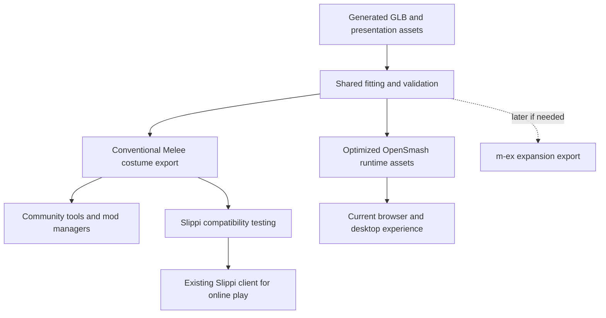

# OpenSmash Melee ecosystem audit

## Recommendation

**Keep the custom-character product and the working runtime, but change the integration strategy. Make portable character output a first-class deliverable; use the existing Slippi ecosystem for competitive online play; consolidate runtime work with the recompilation projects already underneath this project.** Do not commit to another engine migration or to building a competing matchmaking service on the evidence available today.

The concern about duplication is justified in particular areas: mod installation, generic asset editing, replay viewers, platform launchers, and future source-port work. It is much less justified for OpenSmash's central capability: taking generated rigged characters, preserving their appearance, fitting them to Melee fighters, and making a large library immediately playable. None of the examined alternatives establishes that complete workflow.

There are also real browser and non-emulator alternatives. They are not all equivalent. A newly published Windows source port is worth a bounded engineering comparison. A Gecko-based Melee browser project explicitly lacks verified browser boot and performance. An Aurora-based MeleeXR project is at compile validation. Melee Light is a gameplay recreation, and Slippi Lab is a replay viewer. The closest existing static-recompilation stack is already integrated here. [1–8](#sources)

This assessment gives casual custom-character play and authentic competitive play equal weight. Equal importance does not imply one executable should serve both immediately. The practical strategy is one creation pipeline with distinct, explicitly tested playback targets.

## Scope and confidence

The audit reflects public sources inspected on September 11, 2026 and local checkout `22fdbfd30ed9fd6d3ebe109512c1b57486583ba5`. It covers architecture, interoperability, product positioning, runtime alternatives, community tooling, and recommended validation. Local source and existing validation documentation were inspected; third-party binaries were not installed or benchmarked, and no new Slippi compatibility tests were performed. Runtime performance figures below are historical repository evidence, not measurements from this audit.

Confidence is high in the dependency graph and the custom-format compatibility gap, medium in the proposed integration effort ordering, and limited in comparative performance or community willingness to adopt generated content. Public README claims are identified as such. Search cannot rule out private, Discord-only, or newly published ports.

Several sources contain stale sections. MeleePad's older status entries describe failures that later documentation says were resolved; the current README still limits multiplayer to experimental use. The Windows source port's earlier milestone text says fog is missing while a later milestone says it was added. This report uses the later, more specific status and retains unresolved caveats. Repository update timestamps are not release-quality evidence.

## What the project actually is

OpenSmash Melee has three important layers:

| Layer | Implementation observed | Ecosystem relationship |
|---|---|---|
| Character creation/import | Existing OpenSmash generation artifacts: rigged GLB, metadata, portraits, stock art and audio | Product-specific value; not supplied by a game emulator |
| Melee asset conversion | Python HSD/DAT archive handling, skeleton mapping, weighted fitting, GX geometry/texture output | Directly adjacent to existing Melee modding tools |
| Playback and presentation | MeleePad/ModernGekko static recompilation, custom hooks, WebGL browser integration, native runtime in Electron | Reuses major upstream work but introduces its own compatibility surface |

The `melee/` submodule pins doldecomp's matching decompilation. The playable backend is not simply that C source compiled for a browser. It translates the original PowerPC executable through the recompilation stack and supplies console services through a Dolphin-derived runtime. The older `browser-port/` source-port/skinning experiments are separate from the current playable implementation. See [local runtime documentation](../LOCAL_RUNTIME.md), [engine notes](../ENGINE-NOTES.md), and [upstream pins](../../runtime/upstream.json).

The pin file identifies MeleePad `83b81ed…`, ModernGekko `048c426…`, RecompCore `e13ab34…`, and DolRecomp `93b881c…`. The build script verifies the MeleePad checkout and applies local patches. This is substantial integration already, not a new emulator built from scratch. However, pin metadata alone is not proof that every transitive source tree and patch is verified in every packaging path.

The most important interoperability finding is that the project has **two different costume representations**. The conventional conversion path in `gx.py` emits Melee GX envelope geometry. The optimized path in `browser_skin.py` includes an OpenSmash descriptor under a GX_NULL attribute and relies on host skinning. Despite its name, this second path is also used by the integrated native service. A `.dat` extension therefore does not mean the file will animate correctly in unmodified Dolphin, Slippi, or community viewers.

The ordinary exporter and `tools/stage_costume.py` provide a promising bridge: staging verifies the original executable and compares skeleton hierarchy, transforms, inverse binds and descriptor ownership. That is useful evidence of structural preservation. It does not establish online safety, presentation parity, memory headroom, or tournament acceptability. See [exporter](../../opensmash_melee/gx.py), [optimized format](../../opensmash_melee/browser_skin.py), [native selection](../../opensmash_melee/native_service.py), and [staging checks](../../tools/stage_costume.py).

## The ecosystem in plain language

Melee itself did not ship with Internet multiplayer. Community projects add that capability and many others around it. The name is **Slippi**. It is a coordinated system involving modified Dolphin, injected game code, replay infrastructure, launcher software and online services. Its rollback implementation spans the game modifications and emulator; importing a JavaScript library does not add that netcode to a new runtime. The developer guide describes the matchmaking-server source as private. [Developer getting-started guide](https://github.com/project-slippi/slippi-wiki/blob/master/GETTING_STARTED.md)

Rollback predicts missing remote input, continues locally, then restores and replays state if the prediction was wrong. Fixed-delay netplay waits or buffers input. Both can connect two players; they have different latency and engineering properties. A runtime with experimental fixed-delay netplay has not thereby acquired Slippi compatibility.

There is no single owner or universal plugin standard for everything called a Melee mod. Different tools work on textures, native DAT assets, patched executable code, expanded rosters, emulator settings, or replay data. These layers should be treated separately.

| Project or community | What it contributes | Recommended relationship |
|---|---|---|
| Slippi | Online play, replay and competitive infrastructure | Target supported costume exports; retain official launcher/client for online sessions [Developer getting-started guide](https://github.com/project-slippi/slippi-wiki/blob/master/GETTING_STARTED.md), [Project overview](https://github.com/project-slippi/project-slippi) |
| SSBM Nucleus | Mod discovery, installation and organization | Candidate distribution/import partner, subject to an actual package roundtrip [Download and product features](https://ssbmnucleus.net/download) |
| HSDRaw / HSDLib | DAT parsing and visual editing | Independent inspection and interoperability oracle [HSDLib / HSDRaw](https://github.com/Ploaj/HSDLib) |
| DAT Texture Wizard / Melee Modding Wizard | Established disc and asset workflows; MMW incorporates DTW and code-manager functions | Support familiar files; avoid recreating a general-purpose editor [Melee Modding Wizard](https://github.com/DRGN-DRC/Melee-Modding-Wizard) |
| m-ex, MexTK, mexTool, MexManager | Expansion framework and associated tooling | Evaluate when actual new fighter slots or game logic become requirements [m-ex](https://github.com/akaneia/m-ex), [Akaneia Build](https://github.com/akaneia/akaneia-build) |
| Akaneia Build | Expanded Melee content built on m-ex | Learn packaging and roster conventions; possible later export target [Akaneia Build](https://github.com/akaneia/akaneia-build) |
| Beyond Melee | Expanded/rebalanced Melee described by the community hub | Product comparison, not assumed vanilla-compatible infrastructure [Community resource directory](https://melee.tv/) |
| UnclePunch Training Mode and Community Edition | Practice scenarios and training tools | Integration target/reference suite rather than a feature set to duplicate [Training Mode](https://github.com/UnclePunch/Training-Mode), [TrainingMode Community Edition](https://github.com/AlexanderHarrison/TrainingMode-CommunityEdition) |
| UCF and tournament organizers | Controller consistency and event-specific expectations | Define an explicit competitive baseline [Universal Controller Fix overview](https://www.20xx.me/ucf.html), [Construct 160 event settings](https://wismash.com/events/construct-160/) |
| slippi-js and Slippi Lab | Replay data handling and browser viewing | Reuse if replay features become part of the product [Slippi Lab](https://github.com/frankborden/slippilab), [slippi-js](https://github.com/project-slippi/slippi-js) |
| Diet Melee / visual mod projects | Alternative presentation with stated compatibility targets | Learn asset budgets and compatibility testing, not gameplay replacement [Project website](https://diet.melee.tv/) |
| Melee.tv, Melee Workshop, decomp community | Discovery, documentation and specialist feedback | Useful places to learn and eventually contribute; no outreach was performed [Community resource directory](https://melee.tv/), [Credits and community lineage](https://meleeskinmanager.com/thanks) |

### Nucleus is especially relevant

Its current download page advertises Slippi discovery, batch imports, automatic character-select portraits, skin validation/repair, custom character and stage support, effects tools, and shareable bundles. These are publisher claims, not independently validated behavior. Its Tracker product separately provides replay/stats viewing. No stable public integration API or package specification was established in this audit. Start with ordinary export/import and ask maintainers about a supported contract before designing a direct connector. [Download and product features](https://ssbmnucleus.net/download)

SSBM Textures remains useful historically, but its owner announced a September 7, 2026 hosting endpoint and loss of upload functionality. The announcement was still accessible during this audit. Do not infer that all downloads are gone, or that it remains a dependable new-upload destination. Melee.tv still links it, illustrating why directory listings need verification. [End of Hosting Announcement](https://ssbmtextures.com/end-of-hosting-announcing/)

### Expanded rosters are a different requirement

m-ex explicitly supports content expansion and executable code inside fighter and stage files. OpenSmash currently supplies identities that inherit base-fighter behavior and maps prepared characters into costume slots. Those approaches overlap in presentation but are not interchangeable. If the roadmap becomes “new movesets, new mechanics, unrestricted added fighter slots,” re-evaluate m-ex before extending the bespoke roster machinery. [m-ex](https://github.com/akaneia/m-ex)

The current Akaneia instructions use MexManager and a `.mexproj` workflow, so the older mexTool should not be assumed to be the whole current toolchain. MexManager's repository was discoverable but had no README at the queried endpoint; Akaneia's instructions are the evidence for its role. [Akaneia Build](https://github.com/akaneia/akaneia-build)

## Browser and native alternatives: duplication audit

| Candidate | Architecture and observed status | Reuse decision |
|---|---|---|
| **MeleePad / ModernGekko / DolRecomp** | Existing dependency family; native static recompilation with Dolphin-derived services | Continue integrating and consolidate common patches [MeleePad README](https://github.com/chrissotraidis/meleepad), [ModernGekko](https://github.com/ExpansionPak/ModernGekko) |
| **ModernGekko-Template** | Generic extraction, compilation and launch pipeline, including an LLVM backend | Compare build/packaging plumbing before extending local versions; no claim that its LLVM path is a browser backend [ModernGekko-Template](https://github.com/ExpansionPak/ModernGekko-Template) |
| **McDandle/melee-macos-recomp** | Same general static-recompilation family; Apple Silicon app, experimental fixed-delay netplay | Share/review platform fixes; mostly a sibling, not a replacement engine [melee-macos-recomp](https://github.com/McDandle/melee-macos-recomp/tree/39e30dec9fa7d90fba960ca9189b573a7938e3df) |
| **avak1an/MeleeRecomp** | Actual Windows source port from decompiled C with replacement platform services; reports playable matches | Highest-priority alternative to evaluate for source-port work [MeleeRecomp source-port status and known gaps](https://github.com/avak1an/MeleeRecomp/blob/75b0aa1616054b543d6fc39ad879c4a633727454/pc/README.md) |
| **MeleeXR + Aurora** | Source-port effort; reports compilation success but nothing running yet | Collaborate on source/header portability; do not migrate gameplay to it yet [MeleeXR](https://github.com/astelmach20/meleexr/tree/d44502c458ebdb451171083c0479af3d194c6fa4), [Aurora](https://github.com/encounter/aurora) |
| **frankischilling/melee-web** | Gecko/WebGPU integration for real Melee; explicitly unverified browser boot, audio and playable performance | Share browser constraints and fixtures; no evidence it supersedes the current backend [Melee Web](https://github.com/frankischilling/melee-web/tree/d4e7d6850382b84100f6b3d5511738e5447b674a) |
| **ioncodes/gecko** | General Rust GameCube/Wii emulator with browser support and a wgpu renderer | Candidate browser baseline to benchmark, not an established drop-in Melee/Slippi engine [Gecko](https://github.com/ioncodes/gecko) |
| **Melee Light** | JavaScript/canvas gameplay recreation; acknowledges differences from Melee | Useful UX/reference work; adopting it changes the fidelity goal [Melee Light](https://github.com/schmooblidon/meleelight) |
| **Slippi Lab** | Visualizes recorded frame data without gameplay resimulation | Reuse for viewing, not live combat [Slippi Lab](https://github.com/frankborden/slippilab) |
| **RecompCore** | Earlier static CPU/Dolphin foundation; maintainer directs ongoing work toward ExpansionPak | Preserve attribution and relevant oracles; avoid selecting a retired branch as the new upstream [RecompCore](https://github.com/aharonahdoot/RecompCore) |
| **smash64r** | Static recompilation of the N64 Smash game | Relevant to the adjacent original OpenSmash backend, not a Melee runtime replacement [smash64r](https://github.com/zestydevy/smash64r) |

### The Windows source port changes the answer, but does not settle it

Despite its name, MeleeRecomp describes a source-level Windows port rather than the ModernGekko route. At inspected commit `75b0aa1…`, it reports menus, gameplay, audio and replacement-file mods. Its detailed notes also acknowledge unmatched paired-single rounding and `char` signedness, incomplete rendering/audio behavior, and a Flat Zone crash. These are material fidelity concerns. It deserves comparison before another independent source port, but its playable status is not proof of competitive equivalence. [MeleeRecomp source-port status and known gaps](https://github.com/avak1an/MeleeRecomp/blob/75b0aa1616054b543d6fc39ad879c4a633727454/pc/README.md)

The first useful work is exchanging portability findings and running the same acceptance fixtures. A wholesale migration would also have to replace the current browser support and port the OpenSmash presentation hooks. A Windows executable alone does not satisfy those requirements. The project should budget a small evaluation, not implicitly adopt the other repository's architecture based on screenshots.

### Aurora is a real reusable layer, not a completed Melee port

Aurora supplies source-level GameCube/Wii compatibility facilities including graphics, controllers, disc access and memory cards. Its native graphics path uses Dawn/WebGPU and supports multiple native APIs. That is a strong reason to evaluate it for future source-port work. It is not evidence that a complete Melee browser build exists: browser delivery, game portability and simulation fidelity remain separate work. MeleeXR's explicit compile-only status makes this distinction concrete. [MeleeXR](https://github.com/astelmach20/meleexr/tree/d44502c458ebdb451171083c0479af3d194c6fa4), [Aurora](https://github.com/encounter/aurora)

### What “non-emulator” should mean here

A useful comparison asks which responsibilities remain, rather than whether a project uses that label:

1. **Conventional emulation:** execute the original program while modeling the console.
2. **Static recompilation:** translate CPU instructions ahead of time; still supply memory, timing, graphics, audio and other console services.
3. **Source port:** adapt the decompiled program and replace platform interfaces; handle endian, pointer-layout and arithmetic differences.
4. **Recreation:** implement similar behavior in another engine; equivalence must be established independently.
5. **Replay visualization:** display recorded outcomes; does not compute a new match from live input.

OpenSmash uses category 2 for its playable backend. “Native” does not establish lower latency, higher speed or closer fidelity. “WebGPU” does not establish browser deployment. “Compiles all source files” does not establish linking, booting or playable correctness. “120 FPS” does not establish correct Melee timing: rendering interpolation and simulation frequency must be distinguished.

## Audit findings and their consequences

### 1. Strong foundation reuse, weak demonstrated interoperability

The code uses Melee's real archive and skeleton structures, preserves base gameplay intent, and records upstream revisions. Those are good choices. But the inspected first-party paths contain no documented Slippi certification workflow, Nucleus package contract, UCF baseline, or replay interchange integration. Upstream references to networking do not substitute for an application-level feature and test.

**Recommendation:** elevate interoperability to a product acceptance dimension next to appearance, performance and launch correctness. A character should identify exactly which runtime/file format it targets and what has actually been tested.

### 2. The optimized format is the immediate compatibility boundary

The `OSSK` descriptor and custom skinning hook are deliberate performance adaptations. They are reasonable within a controlled runtime, but exporting the cached file as a generic Melee costume would misrepresent its requirements. The same issue affects the custom `OSCS` character-select registry and presentation hooks described in [character selection](../CHARACTER_SELECT.md).

**Recommendation:** maintain a conventional GX export target and an optimized OpenSmash target from the same fitted source. Do not try to make every optimized runtime detail understandable to every existing tool. Export packaging must choose the conventional path deliberately and reject unresolved dependencies.

### 3. Preserving movesets is not sufficient for competitive acceptance

A costume can retain attack logic while changing visual readability, perceived reach, effects, object allocation or loading behavior. Skeleton preservation is useful but insufficient. The default expressive fitting goal can also create silhouettes that poorly represent the base fighter's hit and hurt regions.

**Recommendation:** offer an expressive presentation profile and a conservative competitive export profile. The second needs bounds on silhouette, visibility and asset cost, plus gameplay comparisons. Label custom identities with their base fighter. “Alan Turing — Mario moveset” is clearer than implying a new competitive character.

### 4. The current runtime has not earned a competitive replacement claim

Local documents contain successful short/specific gameplay runs and explicit remaining performance gaps. For example, [launch-mode evidence](../LAUNCH_MODES.md) records an earlier native four-player result around 31–34 FPS and browser four-player results around 46–48 FPS; other, later documents show improvements in selected conditions. These are not comparable enough to rank runtimes or to declare the present build's performance. [Performance notes](../PERFORMANCE.md) also separate particular passing two-player samples from broader acceptance.

The [desktop release notes](../DESKTOP_RELEASE.md) acknowledge platform verification gaps and distinguish reaching combat from validating a full release. The correct conclusion is “sustained, representative performance remains incompletely established,” not “native Melee always runs at 31 FPS.”

**Recommendation:** unify evidence by runtime hash, device, renderer, asset mode, stage, player count, controller path and test duration. Competitive claims additionally require input-to-display measurements and enough spare compute for rollback resimulation. Average 60 FPS alone proves neither.

### 5. Runtime maintenance is becoming a separate product

Browser graphics adaptations, hooks, audio/input handling and Electron frame transport are substantial. The inspected browser patch is 1,142 lines; the native patch files add hundreds more. These counts are scope indicators, not complexity scores. A product centered on character creation should not absorb unlimited console-runtime maintenance by default.

**Recommendation:** maintain a patch ledger: upstream project, pinned revision, purpose, regression evidence, submission status and removal condition. Prioritize generally useful renderer, hook dispatch, input and platform fixes for consolidation. Keep character identity, fitting and catalog behavior in OpenSmash modules. Shared source fixes are valuable even when another project's executable is not adopted.

### 6. Discovery and distribution should complement existing creators

The defensible product value is reducing the effort required to create a usable character. A general mod marketplace or full editor overlaps established work. Generated library size also says little about community usefulness; attribution, curation, clear base-fighter identity and reproducible exports matter more.

**Recommendation:** start with a handful of polished, permission-cleared examples. Let existing modders inspect, revise and redistribute packages under explicit terms. Separate the project's generated gallery from any community catalog integration. Do not bulk republish other creators' work or equate a downloadable file with permission to reuse it.

### 7. Release provenance deserves a concrete engineering check

The repository already notes that native modules contain game-derived code and that private build inputs are not a public source release. Its exporter also preserves original archive data when appending geometry. Thus even a costume output can contain original bytes; “generated mesh” does not imply every byte in its container is new. See [engine notes](../ENGINE-NOTES.md) and [release documentation](../DESKTOP_RELEASE.md).

**Recommendation:** inventory each proposed distributed artifact: original authored sources, upstream runtime sources, patches, generated character content and game-derived output. Prefer a local-build/patch workflow where appropriate and make corresponding-source packaging auditable. This is a release-design finding, not a conclusion that any particular distribution is legally cleared.

## Recommended integration design

The diagram is a proposed architecture. The ordinary conversion foundation and optimized runtime exist; the community packaging and Slippi acceptance paths still need implementation and evidence.

A versioned export manifest should include character identity, author/credits, content terms, source and output hashes, base fighter and costume slot, source-disc revision, exporter/profile versions, required runtime features, optional presentation files, and compatibility results. Preserve upstream/native filenames in the actual exported payload. An internal manifest should not be presented as a community standard until external consumers agree to it.

For each character, report independent capabilities such as “structural export passed,” “Dolphin offline match passed,” “Slippi direct-connect tested on version X,” and “requires OpenSmash runtime.” Avoid one generic “compatible” badge. Tournament eligibility is an organizer decision, not a property the converter can certify.

The initial portable package should contain only the tested costume path and optional clearly separated presentation assets. Do not include the custom launch flow, paging registry or runtime code and expect it to act like a cosmetic skin. A lightweight handoff to the existing Slippi application is sufficient; a deeply embedded second emulator is unnecessary for the initial product.

## Validation plan for the first integration

Use one ordinary humanoid on Mario and one on Fox or Marth, then one deliberately difficult proportion/geometry case. These provide more information than packaging the entire catalog immediately.

| Gate | Evidence required | Failure response |
|---|---|---|
| Portable artifact | Conventional GX layout; no required OpenSmash descriptor/hook; source and target hashes recorded | Fix export selection or mark runtime-specific |
| External inspection | Open in HSDRaw and import through a selected current mod manager; inspect animation, materials and file changes | Resolve reader/importer disagreement |
| Offline gameplay | Full match, results/rematch, grabs/throws, ledges, shields, damage, deaths, equipment visibility, multiple costumes | Fix the character or narrow supported targets |
| Cosmetic isolation | Compare gameplay-relevant state with baseline using fixed input/seed; account for expected cosmetic allocation differences | Do not assert gameplay equivalence |
| Slippi direct connect | Two controlled clients; only one initially uses the cosmetic; both directions, several stages, repeated matches | Diagnose before public matchmaking claims |
| Replay | Record in Slippi; parse with official tooling; verify playback and base-character identity | Fix export or document exact limitation |
| Performance/input | Sustained play and latency against the same unmodified client on the same hardware/settings | Reduce cost or limit supported profile |
| Installation lifecycle | Clean import, conflict report, update and uninstall without altering the source disc/profile | Fix package before distribution |

State comparison needs care. Byte-for-byte RAM equality is generally unsuitable across different asset layouts, and not directly meaningful between a source port and a console-address-space runtime. Compare gameplay state and RNG at defined frame boundaries; retain lower-level CPU/memory oracles where both implementations share the same ABI. Conversely, a selective state comparator can miss a dependency, so it supplements rather than replaces repeated real client tests.

Nucleus's advertised repair process also creates a specific experiment: compare before/after hashes and geometry, then retest the result. If repair changes intentional fitting or discards required metadata, automatic import success is not acceptable evidence.

For native online play, lean first on the existing Slippi client and portable costumes. Browser-to-Slippi crossplay would be a separate substantial program involving deterministic timing, rollback state, client protocol behavior, services and maintainer coordination. Do not promise it as a follow-up toggle.

This initial online path would also have a product limitation: a locally installed costume does not automatically transmit its model, portrait or custom identity to the opponent. Assume local presentation unless both participants install a compatible package. “I can play online wearing my character” and “my friend sees the same generated character automatically” are separate acceptance criteria; the latter needs coordinated asset distribution and agreement on identity.

## Options and tradeoffs

| Option | Casual/custom-character outcome | Competitive outcome | Judgment |
|---|---|---|---|
| Continue exactly as today | Fastest continuity but continuing runtime burden | Interoperability stays unproven | Too insular |
| Replace everything with Slippi | Established client, but loses browser-first experience and custom runtime presentation | Best-aligned execution stack | Useful output target; excessive full-product pivot |
| Move immediately to a source port | Potentially simpler high-level customization later | Fidelity and netcode still require proof | Premature |
| Switch browser engine to Gecko now | May share more browser-emulation work | No established competitive solution | Benchmark first |
| **Keep runtime; add portable output and share upstream work** | Preserves current experience and unique pipeline | Creates a practical path into existing play | **Recommended** |

If competitive adoption becomes the dominant goal, move engineering effort toward the Slippi export workflow and conservative visuals. If browser-native custom-character play dominates, retain the current backend with explicit device/performance gates. If genuine new mechanics become essential, evaluate m-ex or a source-port backend; ordinary online cosmetic compatibility is then a different product promise.

## Prioritized work

Effort ranges are planning estimates for focused engineering work, not commitments. They exclude unpredictable external review and newly discovered runtime defects.

| Priority | Work | Planning range | Decision produced |
|---|---|---|---|
| P0 | Portable versus optimized artifact contract and two representative exports | 2–4 engineering days | Can the current converter feed existing tools? |
| P0 | External tool roundtrip and controlled Slippi test matrix | 3–7 days after valid exports | Is a supported competitive costume output viable? |
| P0 | Reconcile current build evidence and define capability labels | 1–2 days | What can be claimed today? |
| P1 | Compare Windows source port, current runtime and Gecko on common fixtures | 3–5 days for an initial result; stop if a candidate cannot reproduce baseline | Is another backend demonstrably better for a required platform? |
| P1 | Patch/dependency ledger and candidates for upstream consolidation | 1–3 days plus external review | Which maintenance can be shared? |
| P1 | Nucleus package trial and a small curated release candidate | 2–5 days, subject to supported format | Is a custom installer actually necessary? |
| P2 | Replay metadata/import using existing Slippi libraries | Scope after export validation | Is replay demand sufficient to justify integration? |
| P2 | m-ex expansion spike | Only when new slots/logic are a committed requirement | Should roster architecture change? |

A source-port comparison should include ordinary and generated geometry, 2- and 4-player scenes, representative stage effects, full match transitions, controller behavior and long-running stability. Record actual simulation rate separately from rendered frames. Test conventional GX output on both backends; compare the optimized mode separately so a renderer advantage is not confused with an asset-format change.

Choose a replacement only when it reproduces required gameplay, reduces a measured bottleneck or maintenance cost, supports a credible path to required platforms, and has an acceptable integration/maintenance plan. Retain the current backend until that decision has evidence. For Aurora/MeleeXR, the immediate contribution opportunity is portable source/layout work; for ModernGekko siblings it is common runtime/platform fixes.

Do not start a new general mod editor, replay viewer, ranked service, or universal Gecko-code/m-ex loader during this phase. Runtime code injection and dynamically loaded game code are substantive compatibility problems for static recompilation, not just file-import features. Resolve the actual user need first.

## Community engagement and positioning

Recommended positioning: **“Create a character, play it instantly in OpenSmash, and export supported costumes to existing Melee tools.”** Keep the final clause conditional until the export tests pass. This communicates the distinctive value without claiming to replace the competitive platform.

The best initial contributions are small and concrete: a reproducible HSD export fixture, a corrected archive/weight-handling edge case, a measured runtime patch, or a documented roundtrip with Nucleus. Prepare those before asking maintainers for broad integration commitments. Review each project's contribution practices at the time of submission; upstream participation is not guaranteed.

Useful discussion targets are Nucleus for package expectations, HSDRaw/Melee Workshop for asset review, Slippi for compatibility boundaries, and MeleePad/ExpansionPak for runtime consolidation. Melee source-port authors are also worthwhile partners for shared portability fixtures. No messages, issues or pull requests were sent as part of this audit.

## Remaining uncertainty

The strongest missing evidence is a real exported character passing an unmodified Slippi workflow. The next is measured head-to-head behavior of the newer Windows source port and current backend. Public Nucleus format/API stability, controller/device performance, third-party art terms and community demand also remain unresolved. None of these warrants halting the character pipeline; they warrant targeted experiments before expanding infrastructure.

The conclusion is therefore a **qualified stay-the-course recommendation with an integration correction**: keep the useful runtime and character work, expose a portable output, and stop treating generic Melee infrastructure as something OpenSmash must own.

## Sources

Public sources below were accessed September 11, 2026. Where no publication date is given, the page or repository had no stable publication date. Repository documentation describes author-reported status unless explicitly compared with local source. Local links identify the inspected project's evidence and are not third-party validation.

1. chrissotraidis. [MeleePad README](https://github.com/chrissotraidis/meleepad). Architecture and current experimental multiplayer boundaries. Older detail: [netplay beta notes](https://github.com/chrissotraidis/meleepad/blob/main/docs/NETPLAY-BETA-GOAL-LOOP.md).
2. ExpansionPak. [ModernGekko](https://github.com/ExpansionPak/ModernGekko) and [DolRecomp](https://github.com/ExpansionPak/DolRecomp). Runtime, mod ABI, CPU-only recompiler and lineage.
3. ExpansionPak. [ModernGekko-Template](https://github.com/ExpansionPak/ModernGekko-Template). Shared build, extraction, launch and native LLVM paths.
4. McDandle. [melee-macos-recomp](https://github.com/McDandle/melee-macos-recomp/tree/39e30dec9fa7d90fba960ca9189b573a7938e3df). September 8, 2026 inspected revision; scope and experimental fixed-delay netplay.
5. avak1an. [MeleeRecomp source-port status and known gaps](https://github.com/avak1an/MeleeRecomp/blob/75b0aa1616054b543d6fc39ad879c4a633727454/pc/README.md). September 11, 2026 inspected revision; also [project overview](https://github.com/avak1an/MeleeRecomp/tree/75b0aa1616054b543d6fc39ad879c4a633727454).
6. astelmach20. [MeleeXR](https://github.com/astelmach20/meleexr/tree/d44502c458ebdb451171083c0479af3d194c6fa4). September 11, 2026 inspected revision; compile-only status.
7. frankischilling. [Melee Web](https://github.com/frankischilling/melee-web/tree/d4e7d6850382b84100f6b3d5511738e5447b674a). September 8, 2026 inspected revision; unverified browser execution/performance.
8. frankborden. [Slippi Lab](https://github.com/frankborden/slippilab). Replay visualization architecture and limitations.
9. Project Slippi. [Developer getting-started guide](https://github.com/project-slippi/slippi-wiki/blob/master/GETTING_STARTED.md). Components, EXI, rollback location and server-source availability.
10. Project Slippi. [Project overview](https://github.com/project-slippi/project-slippi) and [Slippi SSBM ASM](https://github.com/project-slippi/slippi-ssbm-asm). Competitive/replay mission and injected game code.
11. SSBM Nucleus. [Download and product features](https://ssbmnucleus.net/download). Read from the rendered public page; static search extraction omitted its feature text. No install or import test performed.
12. Ploaj. [HSDLib / HSDRaw](https://github.com/Ploaj/HSDLib). DAT library and viewer.
13. DRGN-DRC. [Melee Modding Wizard](https://github.com/DRGN-DRC/Melee-Modding-Wizard). Tool scope and DTW/MCM lineage; README still describes Python 2 setup.
14. Akaneia. [m-ex](https://github.com/akaneia/m-ex) and [mexTool](https://github.com/akaneia/mexTool). Content expansion, embedded code and companion tooling.
15. Akaneia. [Akaneia Build](https://github.com/akaneia/akaneia-build). Expanded-content project and current MexManager workflow. Referenced tool: [MexManager](https://github.com/Ploaj/MexManager).
16. Melee.tv. [Community resource directory](https://melee.tv/). Discovery links and descriptions of visual/expanded-content mods; listings are not independent compatibility certification.
17. UnclePunch. [Training Mode](https://github.com/UnclePunch/Training-Mode). Practice scenarios and modpack architecture.
18. AlexanderHarrison. [TrainingMode Community Edition](https://github.com/AlexanderHarrison/TrainingMode-CommunityEdition). Community continuation.
19. Dan Salvato / UCF contributors. [Universal Controller Fix overview](https://www.20xx.me/ucf.html). Historical motivation; its displayed version is not treated as the current release. [UCF source](https://github.com/AltimorTASDK/ucf).
20. Wisconsin Smash. [Construct 160 event settings](https://wismash.com/events/construct-160/). Historical organizer example showing explicit UCF, stage and controller/runtime choices; not a universal current ruleset.
21. Project Slippi. [slippi-js](https://github.com/project-slippi/slippi-js) and [replay specification](https://github.com/project-slippi/slippi-wiki/blob/master/SPEC.md). Parsing, statistics and data interchange.
22. Diet Melee. [Project website](https://diet.melee.tv/). Author-stated lower-poly and rollback/unranked/direct-connect compatibility scope.
23. Melee Skin Manager. [Credits and community lineage](https://meleeskinmanager.com/thanks). HSDRaw, DTW, mod hosting and Melee Workshop; useful historical context rather than current market-share evidence.
24. SuperCresAtBest / SSBM Textures. [End of Hosting Announcement](https://ssbmtextures.com/end-of-hosting-announcing/). Announced September 7, 2026 hosting endpoint and upload limitations; page still accessible at inspection.
25. encounter and contributors. [Aurora](https://github.com/encounter/aurora). Source-level compatibility facilities, native platform support and Dawn/WebGPU graphics.
26. ioncodes. [Gecko](https://github.com/ioncodes/gecko). Browser support, emulator features and stated compatibility limits.
27. schmooblidon and contributors. [Melee Light](https://github.com/schmooblidon/meleelight). JavaScript recreation and explicit fidelity caveat.
28. aharonahdoot. [RecompCore](https://github.com/aharonahdoot/RecompCore). Static CPU core, differential oracle and maintainer's direction toward ExpansionPak; historical performance figures were not generalized to Melee.
29. zestydevy. [smash64r](https://github.com/zestydevy/smash64r). N64 Smash recompilation, distinct from Melee.
30. doldecomp contributors. [Melee decompilation](https://github.com/doldecomp/melee). Matching GameCube target; the README distinguishes matching compilation from a portable computer build.

Local evidence: [README](../../README.md), [parity acceptance](../PARITY.md), [local runtime](../LOCAL_RUNTIME.md), [launch modes](../LAUNCH_MODES.md), [performance](../PERFORMANCE.md), [desktop release](../DESKTOP_RELEASE.md), [character selection](../CHARACTER_SELECT.md), [engine notes](../ENGINE-NOTES.md), [upstream pins](../../runtime/upstream.json), [conventional GX writer](../../opensmash_melee/gx.py), [optimized costume writer](../../opensmash_melee/browser_skin.py), [native service](../../opensmash_melee/native_service.py), [costume staging](../../tools/stage_costume.py), [runtime hooks](../../runtime/mods/launch_match.c), and [browser host bridge](../../runtime/web/main.cpp).
